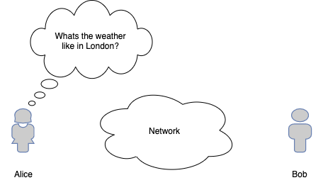
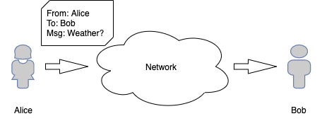
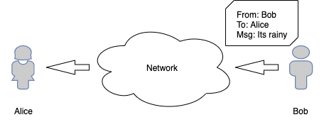
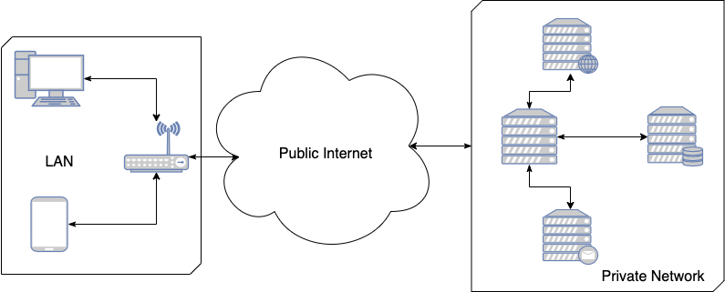

# The client-server model

The client-server model is a communication model for distributed systems. As the name implies, there are two main roles in this model, the **client** and the **server**, and the model describes how they communicate with each other over the network.

## The Client role
The client role is a single entity that requests information from a server. The main characteristic of the client is that it makes a resquest and expects a response from the server, the client role is an 

There is often multiple clients making concurrent requests to the same server, so the relationship between client and server is not a 1:1 relationship.

## The Server role
The server role's main characteristic is that is constantly "listening" to incoming requests from one or more clients. When a request appears, the server computes the response and sends the resources to the requester. Multiple clients can consume the same resources in the server.

## A simplified example.

Alice lives in Sydney and Bob lives in London, they are far, far away from each other, and they need to **share some information**. More specifically, Bob has information that Alice wants, lets say the local weather, and Alice needs a way to get this information.

  

> _Alice (The client) wants to get some information from Bob (the server)_

For Alice to get the information she needs, she sends a message through the network that Bob can **receive** and **understand**. In order to reach Bob, Alice creates a message that contains Bob's address, the message content and her own Address (so that Bob know where to send the information to).

  

> _The message needs to comply with a defined structure for the network to be able to deliver it to the appropriate destination, and for the server to understand it_

The message travels through the network and reaches Bob. When Bob gets the message, he sees that it's coming from Alice and after checking the message's content, he looks out the window and replies to Alice with the information that she wants. To do this, he constructs a message that contains his response, Alice's address and his own address (the sender).

  

In the client-server model, Alice undertakes the role of the **client** and bob the role of the **server**. The message, in this case, is an **HTTP Request** that has a pre-defined structure that the network uses to route the message from the client to the server. The server then computes the response to the request, and it emits an **HTTP response** that the client receives and interprets.

## A more realistic example.

Removing the abstraction of Alice and Bob as client-server, a more realistic scenario would look like the following diagram:

  

Software running in the users's devices (desktop or mobile phone) acts as the client, and the server is a physical machine that lives in a private network that can be accessed over the internet.

When you, as a user, use your phone or laptop to open a website (say https://noobcoding.org), the following process takes place.

1. The browser (the client) makes an HTTP request using the URL of the website
2. The HTTP request is routed through the public internet network and reaches a web server running in someone's computer (large, fast and efficient computer).
3. The server validates the request (security, etc) and gathers the resources requested by the browser (HTTP, CSS, JS files).
4. The server starts **flushing** (sends to the browser) the assets (HTML document) as an HTTP responses.
5. The browser receives the response and interprets it.
6. The browser starts parsing the HTML document and displays it to the user.
7. If the HTML document depends on other assets (Images, Stylesheets, Scripts), for each resource, the browser makes new HTTP requests to the server to continue to download the assets.

# Key Take-away points
1. The client-server model is a communication model where multiple clients can request information from a server.
2. Each entity involved in the communication, undertakes a role, either as the client, or as the server.
3. Clients request information as they need it.
4. Servers are constantly listening for incoming requests (from clients)
5. Clients and servers depend on pre-defined message structures (Like HTTP) to share information between each other.

## Up next: [Understanding the Browser](../2_browser/readme.md)

# Contributors
[Daniel Ormeno](https://github.com/DanielOrmeno)
