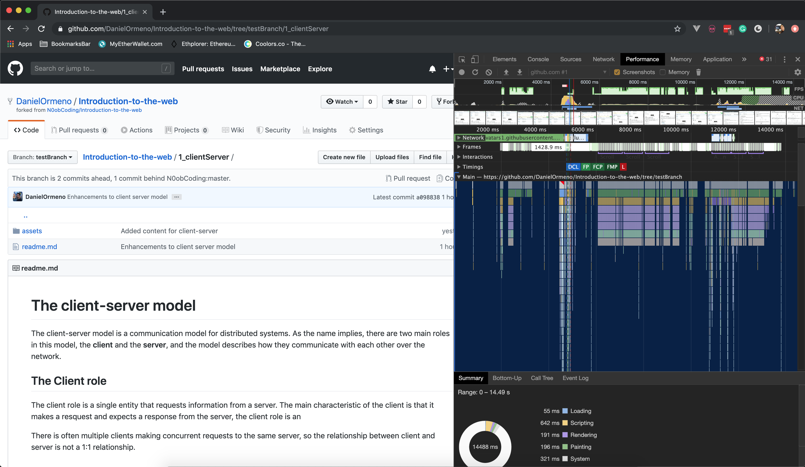

    
    
    
    

# **Understanding the Browser**
A browser is a client-side application that enables users to access resources that are hosted on the internet. It serves as the gateway between the user and the Web, and it has the responsibility of allowing the user to interact with websites and web applications.

> In relation to the previous module, the browser is the **client** in the **client-server** model. It is responsible for sending requests to a server (or servers) and handling the responses.

Browsers are capable of fetching and interpreting different types of resources, such as HTML documents, images, videos, and PDF files. Additionally, Browsers know how to compose, arrange and style a large number of resources and assets, and to visually compose what the user sees and interacts with.

## The evolution of the Web Browser
In the last few years, browsers have evolved from being a simple interface that requests static files from a server to present them to the user, to a more complex echosystem of tools and components that allow for more complex and dynamic applications to be consumed by the end-users.

 Below we can see the [Netscape Navigator](https://en.wikipedia.org/wiki/Netscape_(web_browser)), one of the first widely used web browsers.

  

Modern browsers are highly complex applications that expose an ever growing number of features for both end users and developers. Browsers are extendable (through browser extensions), versatile and can even allow for modern applications to work offline.

As a web developer, the browser will not only be the portal for users to interact with your applications, but it will also be one of your best allies when developing and debugging features. You will spend a significant amount of time testing and exploring your application using the Browser Developer Tools, so its important to understasnd how the browser works and how we can use it to develop software.

Below we can see the profiling tool in the developer tools of chrome, just one of the many features that the browser gives us to help us while we develop our apps.

  

## **How does a web browser work?**
Now that we have understood what a browser is. Let's do more technical dive into how the browser works. Lets take a bird's eye view of what happens when we navigate to a website using our browser.

First, whenever you enter the url in the address bar and hit, the browser sends a request to a Domain Name **Server**, often called a DNS (abbreviated).

## Domain Name Server
A few years back, we would use a phonebook to find the phone number of business and people that we wanted to contact thorugh the phone.

Similarly, Domain Name Servers are a large collection of tables that contain domain names and their corresponding network addresses (IP Address). These servers are somewhat synchronized and they keep track of what IP address are mapped to what domain names.

Domain Name | IP Address
---------- | ---------
google.com | 172.217.14.238
noobcoding.org | 108.168.157.70
github.com | 192.30.255.112

Now the responsibilty of the DNS server is to look up the domain name that is requested by the browser, for example `www.noobcoding.org` and return the corresponding IP Address `108.168.157.70`.

Back to the browser again. Now the response from DNS server is received by the browser. The browser uses the resolved IP Address to send an HTTP GET request, asking for the resource that is hosted on that particular address on the internet.

As we know, the server is constantly listening for request and it responds with the requested resource to the browser.

Now, the browser renders the resource by using certain languages. They are:

* **HTML Documents:** HTML stands for Hypertext Markup Language. This language consists of several html tags.The browser uses this tags to identify the type of content and how to display it.
* **CSS Stylesheets:** CSS stands for Cascading Style Sheets. CSS is used to specify how the content should be displayed on the web page.
* **JavaScript Scripts:** JS stands for Javascript. JS is used to make the web page to respond to user actions. Every web browser has a dedicated javascript engine. V8 is google chrome's javascript engine, Spider Monkey is the javascript engine of Mozilla Firefox, Chakra is the javascript engine of Microsoft Edge.

This is the basic overview of a web browser. Apart from this, web browser consists of various debugging tools and utilities to test the performance of the website and the browser.

## Different Browsers, different worlds

Different browsers that are developed by different companies such as Google Chrome, Mozilla Firefox, Apple's Safari, and Microsoft's Internet Explorer and Edge.

Allthough many browsers have a very similar set of features, the implementation by each company is often differrent. For our users, this can result in a different experience when interacting with our applications.

You, as a Software Developer, are responsible of understanding the capabilities and limitations that each browser has, and work around them so that your users can have a seamless experience across different browsers.

# Key Take-away points
* The Browser allows users to _interact with resources in the web_
* The Browser acts as the _client_, **requesting** resources from the server.

## Up next: [The Document Object Model (DOM)](../3_dom/readme.md)

# Contributors
* [Daniel Ormeno](https://github.com/DanielOrmeno)
* [Rohit Arram](https://github.com/rohit1636)

---

**Disclaimer**: In the interest of simplicity for the scope of this course, the above is an overly simplified description of the browser. As we progress through the course, we will continue to understand the power behind these applications.

~~Every resource that is hosted on the internet has a unique id which is called as Uniform resource Identifier.~~

~~There are different versions of browsers available for different sizes of devices such as mobiles and desktops.~~